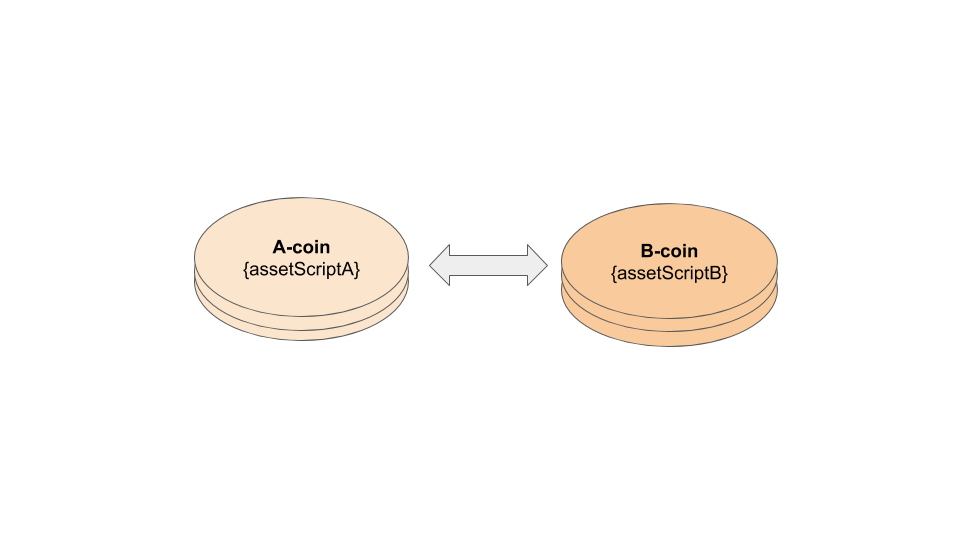
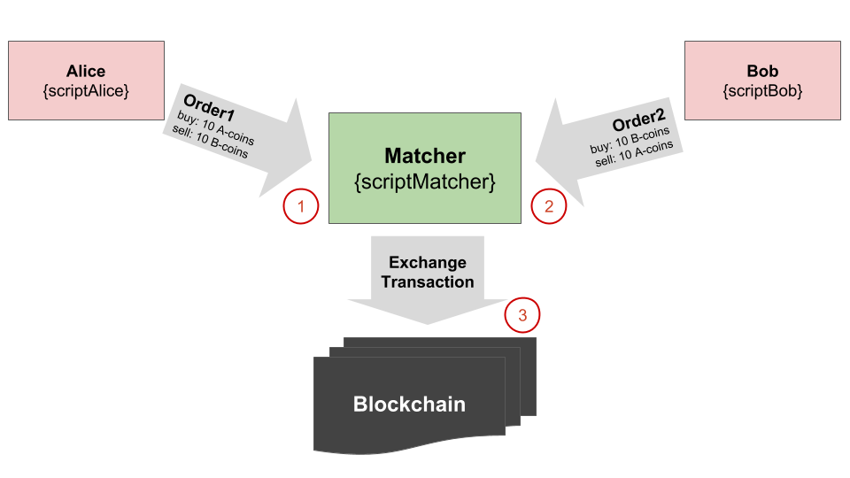

# Smart Assets


1. [Smart Assets Definition](#smart-assets-definition)
2. [Smart Assets Features](#smart-assets-features)
3. [Smart Assets Use Cases](#smart-assets-use-cases)
4. [Smart Asset Fees](#smart-asset-fees)
5. [Trading](#trading)
6. [Validation](#validation)
7. [Examples of Scripts for Smart Assets](#examples-of-scripts-for-smart-assets)

## Smart Assets Definition

_**Smart assets**_ are unique virtual currency tokens that may represent a tangible real-world asset, or a non-tangible ownership that can be purchased, sold, or exchanged as _**defined by the rules of a script**_ on the Waves blockchain network.

In simple words, **Smart assets** are assets with an attached script which validates every transaction within that asset.

## Smart Assets Features

* **Smart assets** will allow to apply constraints on all operations for a specific asset.
* **Smart assets** will offer a great degree of autonomy, anonymity, and low-cost of transactions.

## Smart Assets Use Cases

Smart assets can be used in the following cases:

1. **Freezing assets:** It is similar to keeping the assets untouched for a particular interval of time or for a certain height, This is useful in case of having multiple funding rounds.
2. **Whitelist/blacklist:** Giving the possibility to allow/deny making a transfer for specific addresses.
3. **Taxation:** The issuer can get a share after each transaction.
4. **Multi-signature:** It's a digital signature scheme which allows a group of users to sign a transaction, It requires another user or users to sign a transaction before it can be broadcast onto the blockchain.
5. **Controlling Asset Pairs:** Tokens interchangeable with a certain currency only.
6. **Gaming:** The smart asset can be used to transfer an asset only under certain conditions \(holder has a certain attributes in a certain location\).
7. A token that indicates some commitment/debt \(unburnable, may only be transferred back with permission of the issuer\).
8. Require asset's owners to use a specific matcher.

# Smart Asset Fees

The transaction fee is calculated in the same way as for [smart accounts](../smart-contracts/smart-accounts.md): for each time the script is called, [total transaction’s fee](../waves-environment/waves-protocol/transactions-fees.md) increases by 0.004 WAVES.

**Examples:**

* If user will transfer smart assets from scripted account the final fee is 0.009.waves
* x for a TransferTransaction of a Smart Asset from a Smart Account would be 0.001+0.004+0.004=0.009 WAVES

**Note.** If a scripted account transfers a smart asset, then the fee is increased twice \(the fee increases _**+0.004**_ every time the transaction is validated by account’s script or asset’s script\).

## Trading

Trading on SmartAssets is allowed \(node validates every ExchangeTransaction using scripts of the two assets in AssetPair\).

### Fee Calculation Rules for Trading

If an Asset Pair contains a Smart Asset then the fee is increased by + 0.004 \(+0.008 if both assets are smart\). It doesn't matter if any of the accounts is a SmartAccount, SmartAccounts pay in the same way as non-smart Accounts do.

| Asset Pair | Fee |
| :--- | :--- |
| Asset / Asset | 0.003 |
| Asset / SmartAsset | 0.003 + 0.004 = 0.007 |
| SmartAsset / SmartAsset | 0.003 + 0.008 = 0.011 |

This fee is payed to the Matcher by every account that is placing an order. The same fee is payed by the Matcher when an ExchangeTransaction is put into the blockchain.

If an ExchangeTransaction's sender \(the Matcher or any other account\) has a script then the total fee for the transaction is increased by 0.004 waves.

## Validation

A smart asset’s script validates any of [_**the following transaction**_](../waves-environment/waves-protocol/transactions-structure.md) types with the asset:

1. ReissueTransaction
2. BurnTransaction
3. TransferTransaction
4. MassTransferTransaction
5. ExchangeTransaction
6. SetAssetScriptTransaction

__The following transaction types are not validated by smart assets’ scripts:__
 * IssueTransaction
An asset that is already issued cannot be issued again, so validating IssueTransactions by smart asset’s script doesn’t make sense.
 * SetSponsorshipTransaction
Sponsorship of smart assets was prohibited due to the fact that sponsorship can require an extra validation (if a TransferTransaction contains feeAsset). However, when an asset issuer sets sponsorship to the asset, they may foresee this situation, so smart asset sponsorship will be probably allowed in the forthcoming releases.
 * LeaseTransaction, LeaseCancelTransaction, AliasTransaction, DataTransaction, SetScriptTransaction
These transactions don’t involve any assets.

**Note.** Smart Assets scripts **do not validate orders**. Therefore, although RIDE allows to use `case t : Order => …` branch, in fact this branch does not validate anything when used in SmartAssets’ scripts and will be ignored. So all the logic regarding orders should be moved to `case t : ExchangeTransaction => …` branch. The Sponsorship of smart assets is _**prohibited**_.

**Validation in smart trading**

Smart accounts’ scripts validate both Orders and ExchangeTransactions. Smart assets’ scripts validate only ExchangeTransactions.
For example, if you want to validate Orders that are placed by your account, then you shouldn’t be able to filter counter-orders, because they are placed by someone else. This can be made via “case order => …” branch, where you have access to your Order fields only.
You can also validate your ExchangeTransactions with your account’s script, but in that case the validation will have a different meaning: you will take on the role of a scripted matcher. In this case, you have access to all fields of the transaction, including the orders.
The smart assets’ scripts validate ExchangeTransactions but not Orders. There is no need to restrict access to a counter-order because the order does not belong to an asset. Moreover, the asset is present in both orders (asset pairs in both orders are the same), and there is no need to validate each of these orders separately with an asset script.

**Access to proofs from scripts**

Access to proofs from smart assets’ scripts is denied in order to guarantee no collisions with processing proofs in smart accounts’ scripts.
For example, if a smart asset’s script requires that all the transactions with this asset had a certain value written in proofs[1], then smart accounts that use multi-signature and refer to proofs[1], are not able use this asset.

## Smart Asset Creation

You can create a smartAsset via [IssueTransaction\(Version2\)](../waves-environment/waves-protocol/transactions-structure.md) and specify the script in this transaction.

Here’s an example of JSON for [IssueTransaction\(Version2\)](https://nodes.wavesnodes.com/transactions/info/FTQvw9zdYirRksUFCKDvor3hiu2NiUjXEPTDEcircqti):

```js
{
 "type" : 3,
 "version" : 2,
 "senderPublicKey" : "rWaQhEMTz6saZmZwLR3iuLBhCU2QSq51QmfTX9Je2Mk",
 "name" : "mySmartAsset",
 "description" : "my smart asset",
 "quantity" : 2000000,
 "decimals" : 6,
 "reissuable" : true,
 "fee" : 100000000,
 "timestamp" : 1537456619027,
 "script" : "base64:AQa3b8tH", // the compiled script “true”
 "proofs" : ["3fP2NNKtqRjJQsVXkhXKFcdU7YvRBrJ4Ren6tg8a3g1wuctrfp8PfDap6"]
}
```

**Note**  
The assets that were issued without a script cannot become scripted. You can create an asset that behaves as non-scripted but can be upgraded later, by issuing an asset with a script: **'true'**.

## Changing a Smart Asset's Script

A smart asset’s script can be changed via [_**SetAssetScriptTransaction**_](../waves-environment/waves-protocol/data-structures.md) \([fee](../technical-details/transactions-fees.md) on changing is equal to 1 WAVES\).

Only the issuer can change the asset's script.

## Examples of Scripts for Smart Assets

You can find an example of _**SetAssetScript **\_transaction on _**testnet**\_ in the following [transactions examples](../waves-api-and-sdk/waves-node-rest-api/example-transactions.md).

### 1. Issue an unburnable asset

For issue an unburnable asset you can use [pattern matching ](../smart-contracts/ride-langauge/lang-stlib-usage-examples.md) with a `false` value to BurnTransaction:

```js
match tx {
  case t : BurnTransaction => false
  case _ => true
}
```

### 2. Asset Freezing

You can freeze your assets till the certain height by defining a target height variable:

```js
let targetHeight = 1500000
height >= targetHeight
```

### 3. Getting a share after each asset transfer

For requiring a fee in a certain asset to get a share after each transfer you can use TransferTransaction depending on the asset id:

```js
match tx {
  case t : TransferTransaction =>
    t.feeAssetId == base58'oWgJN6YGZFtZrV8BWQ1PGktZikgg7jzGmtm16Ktyvjd'
  case _ => true
}
```

### 4. Transferring by issuer permission

You can restrict the token transfer option to be done only by the token issuer's permission \(commitment/debt label\):

```js
match tx {
  case tx : TransferTransaction =>
    let issuer = Address(base58'3P6ms9EotRX8JwSrebeTXYVnzpsGCrKWLv4')
    isDefined(getInteger(issuer, toBase58String(tx.id)))
  case _ => false
}
```

### 5. Issue an untransferable asset

To make the asset untransferable, you can assign a `false` value to TransferTransaction, MassTransferTransaction and ExchangeTransaction:

```js
match tx {
  case t : TransferTransaction | MassTransferTransaction | ExchangeTransaction => false
  case _ => true
}
```

### 6. Asset tradable only with BTC

To allow asset trading only with bitcoins you can do as here:

```js
let BTCId = base58'8LQW8f7P5d5PZM7GtZEBgaqRPGSzS3DfPuiXrURJ4AJS'
match tx {
  case t : ExchangeTransaction =>
    t.sellOrder.assetPair.priceAsset == BTCId || t.sellOrder.assetPair.amountAsset == BTCId
  case _ => true
}
```

### 7. Require using a certain matcher

To define a certain matcher, you can assign the matcher address as a sender value:

```js
match tx {
  case t : ExchangeTransaction =>
    t.sender == addressFromString("3PJaDyprvekvPXPuAtxrapacuDJopgJRaU3")
  case _ => true
}
```

## Example of smart trading validation
Let’s consider an exchange of two smart assets:



Alice and Bob (both have smart accounts) place their orders to the matcher (the matcher has its own script). When the two orders have matched, the matcher creates an ExchangeTransaction and tries to put it into the blockchain.




In this case, the following validations are performed:

1. Matcher validates Order1
* with scriptAlice (case Order => )
* with assetScriptA (case ExchangeTransaction => )*
* with assetScriptB (case ExchangeTransaction => )*
2. Matcher validates Order2
with scriptBob (case Order => )
* with assetScriptA (case ExchangeTransaction => )*
* with assetScriptB (case ExchangeTransaction => )*
3. Node validates ExchangeTransaction
* with scriptMatcher (case ExchangeTransaction => )
* with assetScriptA (case ExchangeTransaction => )
* with assetScriptB (case ExchangeTransaction => )
* validates ExchangeTransaction.buyOrder with scriptAlice (case Order => )
* validates ExchangeTransaction.sellOrder with scriptBob (case Order => )

\*Matcher validates Orders by the assets’ scripts as follows: the matcher creates an auxiliary counter-order, puts the two orders to an ExchangeTransaction and validates this transaction via the assets scripts’ “case tx: ExchangeTx => …” branches.

As a result, for the Orders placement Alice pays fee=0.011 waves to the matcher, Bob pays fee=0.011 waves to the matcher. When the ExchangeTransaction is being put into the blockchain, the fee payed by the matcher is 0.011+0.004(because of the matcher’s script)=0.015 waves.
