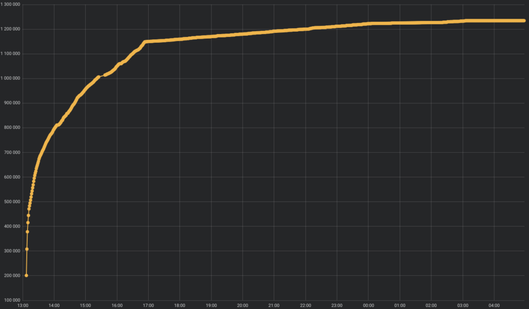

# Options for Getting Actual Blockchain

After a user installs a node, the user will have different ways to get the blockchain as the following:

## 1. Synchronization of the state during a regular operation of the node.

Build from scratch, here you will need to [_**run the node**_](/waves-full-node/how-to-install-a-node/how-to-install-a-node.md), then it will receive all the needed information from the other nodes.

After launch, the node begins to receive blocks from the network, verify them and validate the signature.  By affecting these components, you can reduce the time to reach the current state.  So, the following factors affect network sharing:

* Internet channel width
* network latency
* number of connected peers
  If the first two parameters depend only on your Internet provider, the third one can be affected by the max-outbound-connections parameter.  We believe that the default value of 30 is enough.  In general, network sharing has little impact on the total time \(unless of course, you have a dial-up connection\).  Much more expensive are a block verification time and a signature verification, which we will discuss in the next paragraph.

## 2. Importing state from a previously prepared file

The user needs to stop the node before starting the process of importing the blocks.

> [!TIP]
> Please follow the steps to import from blockchain by the link below. 

 Import From Blockchain 

If the node is on a fork with a height more than 2000 blocks, it should choose an option for getting the actual blockchain. This can be achieved by updating the node version and reimport the blockchain.

> [!DANGER]
> If your node is on a fork and you want to update it, please do not export/import your own blockchain but download the recent exported blockchains from the provided links below(the file blockchain_last.tar) otherwise your node will stay on the fork.

 Mainnet 
 Testnet 

 
The speed of block verification and signature verification affects the time of reaching the current state by the import method. These operations are performed on the CPU. The verification of the blocks goes in one stream, therefore, a gain in time will be given by a high-frequency CPU rather than a multicore one. The signature verification operation is multi-threaded, but against the background of block verification, it has an insignificant effect. In other words, there is practically no difference when using 8 or 16 cores CPUs operating at the same frequency. The remaining blocks will be synchronized during normal operation.

> [!NOTE]
> When synchronizing the state, an active writing to disk exceeds the IOPS values that the HDD gives. In particular, there may be delays when the operating system doesn't have enough physical memory. We recommend keeping at least 30% of the total memory for the needs of the operating system \(cache/buffers\).  
Therefore, we choose SSD.

## 3. Copy the finished node database

[_**Downloading state**_](/waves-full-node/options-for-getting-actual-blockchain/state-downloading-and-applying.md), approximately the size of the State is around 23 GB \(**in November 2018**\).

In this case, the longest operation is to download the archive. Then it is enough to unpack the archive files to the /var/lib/waves/data directory and run the node.  The remaining blocks will be synchronized during normal operation.

## Statistics \(0-1220000\)

Block verification is not a linear operation, “heavy” blocks are verified longer. The ”heaviness" of a block is determined by the number and type of transactions it contains.  So the first blocks \(for example, the first 200.000\) are empty and verified much faster than the same number of blocks after the million.  On the chart it looks as follows:

The time to reach the block 1220000 on different CPUs \(number of cores and frequencies\) in numbers:

| CPU/MEM | Synchronization time | Import time |
| :--- | :--- | :--- |
| Intel Xeon Platinum 8175M @ 2.50 GHz \(8 vCPU\)/32 GB | 11:25. | 10:20. |
| Intel Xeon Platinum 8124M @ 3.00 GHz \(16 vCPU\)/32 GB | 10:45. | 10:05 |
| Intel i7 8550u @ 1.8 GHz \(up to 4GHz\) \(8 vCPU\)/16 GB | 9:35. | 9:20. |

 You can go through the links above for more details about each step.